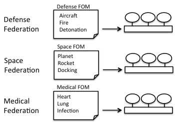

# The Federation Agreement

When you connect several simulation systems you need to decide exactly how the federates are to exchange services. This will be different for example between a flight simulation federation and a medical federation. The exact contract (or design document) for this is called the Federation Agreement.

One important part of this is a description of the types of information that needs to be exchanged – the language of the federation. This is described in a Federation Object Model (FOM), which is part of the Federation Agreement.

You need different FOMs when running defense, space, medical, or
manufacturing simulations since you need to exchange data about different
concepts, as shown in figure 2-3. You can develop a FOM for any domain.