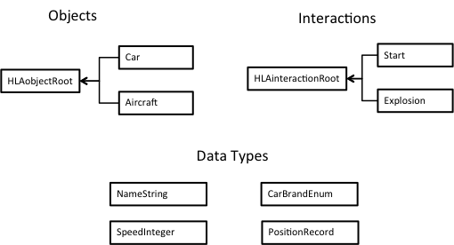
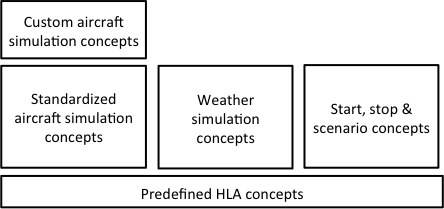

# The Federation Object Model (FOM)

Three of the most important things in the FOM are the Object classes, the Interaction classes, and the Data types, which are shown in the diagram below:

### Object

An object is something that persists over time and has attributes that can be updated. A car is a typical object class. Name, position, and speed are typical attributes.

### Interaction

An interaction is something that does not persist over time. Start, stop, explosion, and radio messages are typical interaction classes. An interaction usually has some parameters.

### Data Types
The data types describe the semantics and technical representation of the attributes of an object class and parameters of an interaction. There are a number of predefined data types in HLA that can be used to build your domain specific data types, including complex data types like records and arrays.

A FOM contains more things, for example general information about the purpose, version and author of the FOM and more.

You can gradually extend a FOM over time without breaking existing simulations. The need to gradually extend the level of interoperability over time is the rule rather than the exception.

To enable more efficient standardization and reuse, a FOM can be divided into modules. Each module covers a particular concern, for example the information exchange needed between aircraft simulations. It is also possible to extend existing modules with more refined concepts in a new module. In this way a customized aircraft module can build upon a standardized module.

The FOM follows a format called the HLA Object Model Template, which is based on XML. This format is described in the HLA standard. There are also XML Schemas that can be used to verify the format of an object model.