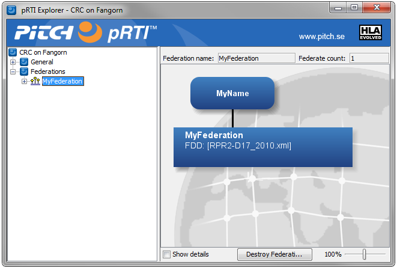

# Connecting and Joining

When a simulation is part of a federation it is called a federate. The first thing that your federate needs to do is to call the RTI (actually the LRC) in order to connect to the RTI.

It then needs to join a Federation Execution, which always has a unique name, for example “MyAirSimulation” or “TrainingSession44”. There may exist many Federation Executions at the same time but a typical simulation will only join one Federation Execution. It may be necessary to create a Federation Execution if it doesn’t exist. These are the services we need to use to create the federation execution and to join it:

```cpp
rti = RTIambassadorFactory.createRTIambassador()
rti.connect(federateAmbassador, IMMEDIATE, “MySettingsDesignator”)
rti.createFederationExecution(“MyFederation”, “MyFOM”)
rti.joinFederationExecution(“MyName”, “MyFederateType”, “MyFederation”)
```

### A look at the RTI

By looking at the user interface of the RTI, it is easy to verify that the federation execution has been created and that the federate has joined.



### Resigning and Disconnecting

At the end of the program we need to resign from the federate, destroy the federation execution, and finally disconnect. We will then use the following services:

```cpp
rti.resignFederationExecution(CANCEL_THEN_DELETE_THEN_DIVEST)
rti.destroyFederationExecution()
rti.disconnect()
```
