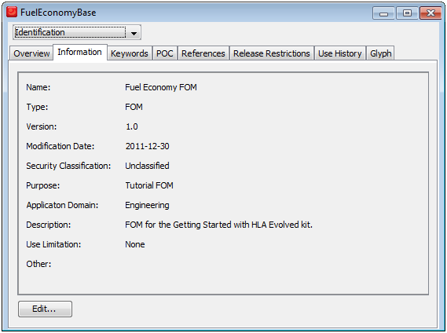

# Overview

We will now create a FOM for this federation. It will describe the information that needs to be exchanged between federates. The FOM will thus not contain all of the internal data of the federates. The exchanged data will be modeled as object classes and interaction classes. Object classes have attributes that can be updated over time. Interaction classes only exist for a short moment. Note that the FOM describes object classes, not the object instances.

The following shared information will be modeled in our sample:

- A number of messages to start and stop the simulation and to manage the scenario will be modeled as Interaction Classes.
- A number of data types for attributes and parameters will also be modeled

### A First Look at the FOM

Before we can start exchanging data we need a FOM, which this chapter takes a closer look at. The FOM is implemented as an XML file but it can also be displayed as tables, for example in the HLA standard or in various report formats. In this case we will visualize the FOM in the FOM editing program Pitch Visual OMT.
We will now develop the following items:

- The Identification table
- Interactions with parameters
- Data types

### Identification Table

First of all we need to provide the name, purpose, version and author of the FOM. Figure 5-1: Identification table.

It is strongly recommended that you fill in at least this part of the identification with name, purpose, date and version, and that you provide information about yourself in the Point of Contact section. You should also consider applying configuration control of your FOM for example in a version tracking system. 

Read more about the Identification Table in section 4.1 of the HLA Object Model Template Specification.

### More about FOMs
The FOM can be provided as one single file or, for larger FOMs, as several FOM modules. A FOM module is simply a number of related object classes, data types, etc, that are stored in a separate file. It is not uncommon to have FOM modules that extend existing FOMs by providing subclasses. Modular FOMs simplify both the development and maintenance of FOMs as well as their reuse. 

There is one special module called the Management and Initialization Module (MIM). It contains all of the predefined concepts of HLA. We have already seen the HLA Object Root, the HLA Interaction Root, as well as HLAunicodeString and HLAinteger32BE. The MIM is provided automatically by the RTI when a federate calls the Create Federation Execution service. 

As you may have noticed, the classes and data types in the MIM all have names that start with “HLA”. Only MIM concepts are allowed to start with “HLA”.

### Naming Conventions

In our examples we have used a naming convention for data types, where they start with a description of what it measures (Fuel, Angle, Position) and end with the technical representation, for example FuelInt32, AngleFloat64, FuelTypeEnum32, and PositionRec. Note also that we have avoided using the unit or resolution in the name. This type of convention is convenient but not required by the standard.

### Practical Exercise

See the lab section for a practical guide to create your own FOM.