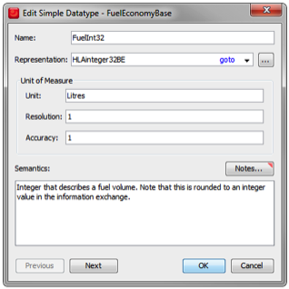

# Simple Data Type

We will need to define a data type for the fuel levels. By having one common data type for fuel we can ensure a clear and consistent definition for all parameters and attributes that relate to fuel levels. For simple data, which consists of just one integer or float, we use the Simple data type. This is what the FuelInt32 data type looks like:

Note the following fields:
- The Representation describes the exact representation of the data when it is exchanged between different federates. In this case the predefined representation HLAinteger32BE is used, which is a 32 bit integer with big- endian representation. In this federation we have chosen to use mainly
- 32 bit integers and floats with big-endian representation.
- The Unit for measuring fuel is the metrical liter.
- The Resolution of the value is one liter.
- The Accuracy (i.e. correctness as compared to the real value) is one liter.

This dialog may at first seem to be unimportant and overly detailed. It is actually extremely important. Sending 16 bits of data to a federate that expects 32 bits may crash that federate. Sending fuel levels in gallons instead of liters will make the output of the federation useless. Sending data with too low resolution or accuracy may cause incorrect computations. 

Read more about Simple data types in section 4.13.4 of the HLA Object Model Template Specification.