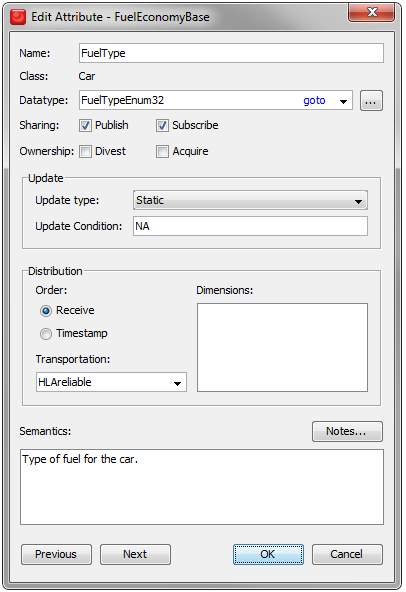
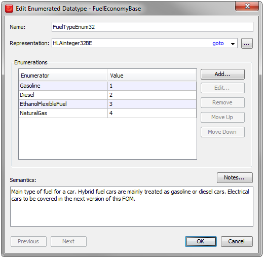
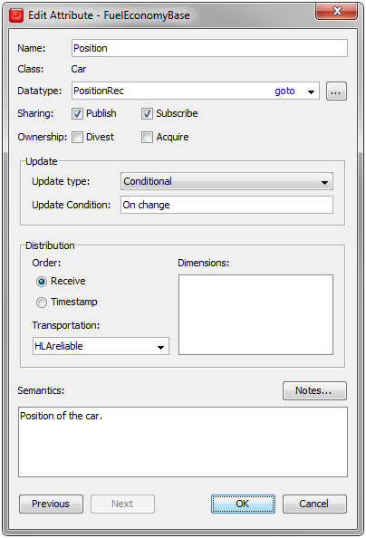
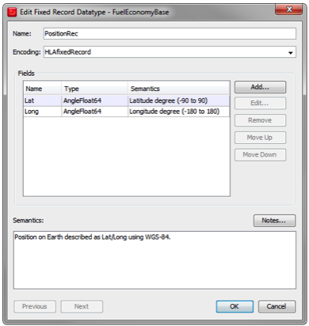
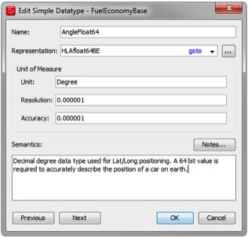

# Complex Datatypes

### Enumerated Data Type

The Fuel Type attribute looks like this:

The Update Type is Static, just like the Name and LicensePlateNumber. As you can see the FuelType is an enumerated value using the data type FuelTypeEnum32. Let’s take a closer look at it:

This is an enumerated data type. It contains some important information:
- The representation of the enumerated value, typically an HLAoctet (8 bits), an HLAinteger16BE (16 bits) or an HLAinteger32BE (32 bits). 
- The different enumerated values and their names. 

Read more about Enumerated data types in section 4.13.5 of the HLA Object Model Template Specification.

### Fixed Record Data Type

We will also look at the Position attribute:

The position will change over time. The Update Type is Conditional and the condition is that an update is sent whenever the value changes. 

The Data type is particularly interesting since it is a Fixed Record. Let’s look at it:

It is important that we exchange data about both the Latitude and Longitude of a position at the same time so they are part of the same record. They both have the type AngleFloat64 so let’s have a look at that:

This is a Simple data type that is used for both Latitude and Longitude.

Read more about Fixed Record data types in section 4.13.7 of the HLA Object Model Template Specification.