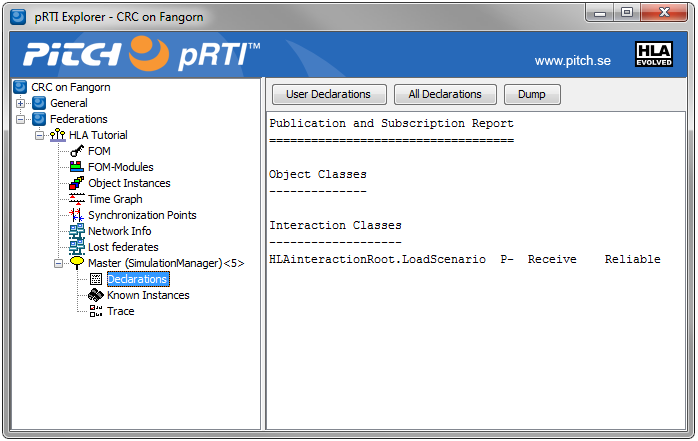

# Interactions Overview

This section tells you how to send and receive interactions from a federate. We will use the LoadScenario interactions as an example since it contains two parameters. To handle interaction, we will cover the following steps:
- Some initial preparations that need to be done. 
- How to send an interaction.
- How to receive an interaction.

### Guidance

Sending interactions is quite easy but receiving interactions is much more difficult for several reasons:
- Your code can decide how many interactions that your federate sends but your federate has no control over how many interactions that it will receive in a federation. Received interactions will impose additional workload on your federate.
- You don’t know exactly when they arrive so you will need to decide when and how they are handled.
- You don’t know how correct the information in incoming interactions is. Experienced federate developers always take precautions and handle decoding exceptions as well as checking the correctness of decoded values.

### Initial preparations for Interactions

Initially we will need to do three things before we start the main simulation loop:
1. Allocate helper objects for correctly encoding and decoding data according to the FOM.
2. Get “handles”, which is a type of reference, for the Interaction Class and its Parameters.
3. Publish and subscribe to the interaction class.

Here is the pseudocode:

```cpp
HLAunicodeString myStringEncoder
HLAinteger32BE myInt32BEencoder

ParameterHandleValueMap parameters
VariableLengthData userSuppliedTag

scenarioInteractionHandle = rti.getInteractionClassHandle(“LoadScenario”)
destinationParameterHandle = rti.getParameterHandle(scenarioInteractionHandle, “Destination”)
initialFuelAmountParameterHandle = rti.getParameterHandle(scenarioInteractionHandle, “InitialFuelAmount”)

rti.publishInteractionClass(scenarioInteractionHandle)
rti.subscribeInteractionClass(scenarioInteractionHandle)
```

First we create some Encoding Helper objects. These helper classes in HLA makes it easy to encode and decode data correctly. For performance reasons we don’t want to create them each time we use them, so we do this before we get into the main loop. We will also need a ParameterHandleValueMap when we send the interaction as well as a userSuppliedTag. We will also create an empty userSuppliedTag since this concept is not used in this example. 

We then need to fetch handles for the LoadScenario interaction in the FOM as well as the Destination and InitialFuelAmount parameters. These handles are used in the RTI calls. Note that they use the concepts from the FOM we created in the previous chapter. Finally we publish and subscribe to this interaction. In this federation, it will be the Master that publishes this interaction class and the CarSims that subscribe to it, but this example shows both calls. The publish and subscribe calls are very important in HLA since they tell the RTI about which federates that will send certain types of information and to which federates they should be delivered.

### Encoding and Decoding Helpers 
These are formally not seen as RTI services. They are utilities that are described in the Programming Language Mappings and the C++ and Java APIs. 

Read more about Encoders and Decoders in section 12.11.3.2 and 12.12.4.2 of the HLA Interface Specification. 

### HLA Service: Get Interaction Class Handle

This service returns a handle for the specified interaction class in the FOM. You are allowed to omit the initial “HLAinteractionRoot” but otherwise the class name shall be fully specified. Note that this service (and many other Get Handle services) may throw a “not defined” exception meaning that there is nothing in the FOM that matches this string.

Read more about Get Interaction Class Handle in section 10.15 of the HLA Interface Specification.

### HLA Service: Get Parameter Handle 
This service returns a handle for the specified parameter of an interaction. The interaction class handle needs to be supplied.

Read more about Get Parameter Handle in section 10.17 of the HLA Interface Specification.

### HLA Service: Publish Interaction Class 

This service informs the RTI that the federate publishes the specified interaction, which means that it can send such interactions.

Read more about Publish Interaction Class in section 5.4 of the HLA Interface Specification. 

## HLA Service: Subscribe Interaction Class 

This service informs the RTI that the federate subscribes to the specified interaction, which means that the federate will be notified whenever another federate sends such an interaction. 

Read more about Subscribe Interaction Class in section 5.8 of the HLA Interface Specification. 

### A look at the RTI 

By looking at the user interface of the RTI it is easy to verify that the federate has indeed published the interaction.

