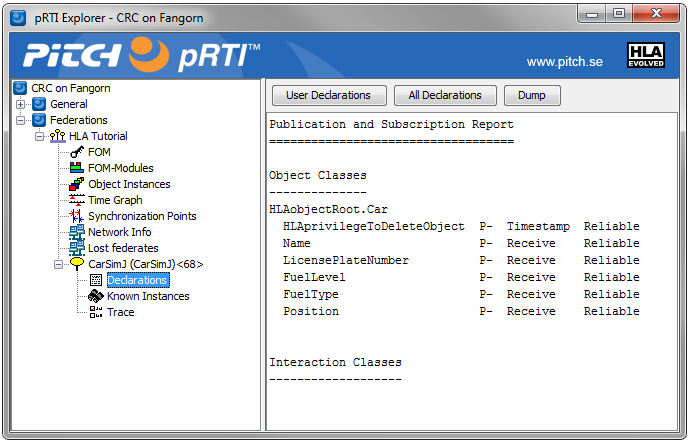
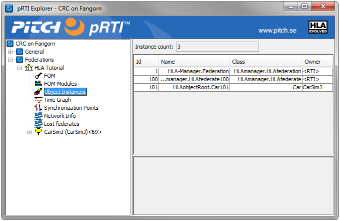

# Registering and Discovering Objects

### Initial preparations for Registering and Discovering Objects

Initially we will need to do three things before we start the main simulation loop:
1. Define some variables
2. Get “handles”, which is a type of reference, for the object class
3. Publish and subscribe to the object class.

Here is the pseudocode:

```cpp
VariableLengthData userSuppliedTag
AttributeHandleSet attrHandleSet
ObjectInstanceHandle carInstanceHandle
ObjectInstanceHandle carInstanceHandle2

carClassHandle = rti.getObjectClassHandle(“Car”)

nameAttrHandle = rti.getAttributeHandle(carClassHandle, “Name”)
licensePlateNumber AttrHandle = rti.getAttributeHandle(carClassHandle, “LicensePlateNumber”)
fuelLevelAttrHandle = rti.getAttributeHandle(carClassHandle, “FuelLevel”)
fuelTypeAttrHandle = rti.getAttributeHandle(carClassHandle, “FuelType”)
positionAttrHandle = rti.getAttributeHandle(carClassHandle, “Position”)
attrHandleSet.insert(nameAttrHandle)
attrHandleSet.insert(licensePlateNumberAttrHandle)
attrHandleSet.insert(fuelLevelAttrHandle)
attrHandleSet.insert(fuelTypeAttrHandle)
attrHandleSet.insert(positionAttrHandle)

rti.publishObjectClassAttributes(carClassHandle, attrHandleSet)
rti.subscribeObjectClassAttributes(carClassHandle, attrHandleSet)
```
We will need an AttributeHandleSet when we specify a list of attributes. We will also create an empty userSuppliedTag. 

We then need to fetch handles for the Car object class in the FOM as well as handles for the attributes of the Car. We insert the attribute handles into the attribute handle set. Finally we publish and subscribe to this object class. In this federation it will be the CarSims that publishes this object class and the MapViewer that subscribes to it, but this example shows both calls.

Here is some more information about these services.

### HLA Service: Get Object Class Handle
This service returns a handle for the specified object class in the FOM. The name of a class may be described as “HLAobjectRoot.Car” or simply “Car”, since you are allowed to omit the HLAobjectRoot. Note that this service (and many other Get Handle services) may throw a “not defined” exception meaning that there is nothing in the FOM that matches this string. 

Read more about Get Object Class Handle in section 10.6 of the HLA Interface Specification.

### HLA Service: Get Attribute Handle
This service returns a handle for the specified attributes of an object. The object class handle needs to be supplied.

Read more about Get Attribute Handle in section 10.11 of the HLA Interface Specification.

### HLA Service: Publish Object Class Attributes
This service informs the RTI that the federate publishes the specified object class. This means that it can register object instances. It also informs the RTI that the federate can send updates for the specified attributes.

Read more about Publish Object Class in section 5.2 of the HLA Interface Specification.

### HLA Service: Subscribe Object Class Attributes
This service informs the RTI that the federate subscribes to the specified object class. This means that it wishes to receive notifications when a new object is registered by another federate. It also informs the RTI that the federate wishes to receive updates for the specified attributes.

Read more about Subscribe Object Class Attributes in section 5.6 of HLA the Interface Specification.

### A look at the RTI

By looking at the user interface of the RTI it is easy to verify that the federate has published the object class and attributes.



### Code for Registration of an Object Instance

To register a Car object instance we just need to make one call. Here is the pseudocode:

```cpp
carInstanceHandle=rti.registerObjectInstance(carClassHandle)
```

This service registers a new object instance of the specified type. It returns a handle to the new instance. We want to save this handle so that we can update this object later on. This object will also get a name that is automatically generated by the RTI.

### HLA Service: Register Object Instance
This service registers a new object instance. The RTI will create a unique instance name and a unique instance handle for the new instance. Optionally an instance name can be provided, which will be described later. Read more about Register Object Instance in section 6.12 of the HLA Interface Specification.

### A look at the RTI
By looking at the user interface of the RTI it is easy to verify that the federate has registered the object instance.



### How to discover object instances

When a new object is registered by one federate, the RTI will make sure that it is discovered by other federates that subscribe to the specified class. If a federate joins a federation where there are already a number of objects, the RTI will also make sure the new federate discovers existing instances of a class it subscribes to.

When an object is discovered a callback is made to the federate ambassador. We usually want to look at which class it is before further processing.

```cpp
Method FederateAmbassador.DiscoverObjectInstance(theClassHandle, theObjectHandle, theObjectName)
IF theClassHandle=carClassHandle THEN
    HlaCar car = new HlaCar(theObjectName);
    _hlaCarMapping.put(theObjectHandle, car);
END IF
```

It is really important to understand that the federate now knows about the existence of the new instance. But it still doesn’t know anything about the fuel level or position of the car. It has no values for the attributes. It doesn’t make sense to present this object to the main logic of you your simulation until the object is initialized, i.e. it has initial values for all relevant attributes.

### HLA Service: Discover Object Instance (callback)
In this example we have simplified the parameter list. There are also optional parameters like a time stamp. Note also that there are actually two different versions of the Discover Object Instance method for the Federate Ambassador in the APIs. Different versions will be called depending on how many optional parameters that are present. It is highly recommended that you dispatch the calls that you don’t use, in this case the ones with additional optional parameters, to the version of the service that you have actually implemented.

Read more about Discover Object Instance in section 6.9 of the HLA Interface Specification.