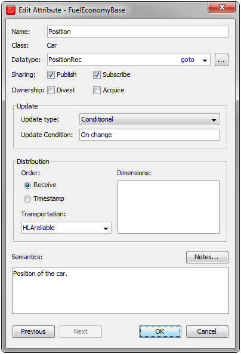

# Updating and Reflecting Attribute Values

### When to Update

Before looking at any code we need to investigate a few aspects of updating attributes. We will start by looking at the FOM again.



The FOM describes three update types for an attribute: 
- **Static**. A typical example is the name or registration plate number of a car. This value will be assigned and updated in the beginning of the simulation and it will not change.
- **Conditional**. A typical example is the position of a car which changes over time. One commonly used condition is “on change” which means that an update will be sent when there is a new value. Another possible condition is to send out a new value when it differs from the most recently sent update with a certain threshold.
- **Periodic**. This means that the value will be sent out periodically even if it did not change. We recommend using conditional/on change instead to save bandwidth and CPU. 

There is some relation to the Transportation type used. We recommend using HLAreliable unless you have special requirements. The opposite is the HLAbesteffort transportation type where updates may be lost. In that case it makes sense to resend updates periodically to enable federates to catch up if they lost previous updates. The HLAbesteffort transportation type has some particular pros and cons since it can use a networking mode called “multicast”.

We will now focus on the attributes with update type Static, like the registration plate number of a car and Conditional/On Change, like the position of a car. When should your federation send updates for such attributes? There are two cases:
1. When you have a new value. For Static attributes this means the first and only time when you have a new value for the name or registration plate number. For On Change attributes this means the first time you have a value and whenever you have an update to that value.
2. When another federate requests a value, no matter if this attribute has a Static or conditional update type. This typically happens when a federate joins into an already existing federation where there are already objects registered. This request normally happens automatically but your federate must respond correctly to it. 

The same code for sending updated can be reused for this purpose but it needs to be called from two different places.

### Initial Preparations

We will show how to update the Position attribute of a Car, which is a record of Latitude and Longitude. We need to provide encoding helpers for this. We also need to define some variables for building and sending the update. Here is the pseudocode:

```cpp
HLAfloat32BE latEncoder
HLAfloat32BE longEncoder
HLAfixedRecord positionEncoder

positionEncoder.addElement(latEncoder)
positionEncoder.addElement(longEncoder)

AttributeHandleValueMap attributes
VariableLengthData userSuppliedTag
```

### Sending Attribute Updates

Here is the pseudocode. We have named this method
“MySendCarPositionMethod” so we can show how to call it later on. We will simply set the new values, encode the data and send the update for the specified instance.

```cpp
mySendCarPositionMethod (carInstanceHandle)
(
    latEncoder.Setvalue(38.897660)
    longEncoder.Setvalue(-77.036564)
    attributes[positionAttrHandle]=positionEncoder.encode()
    rti.updateAttributeValues(carInstanceHandle, attributes, userSuppliedTag)
)
```
Encoding is easy with the encoding helpers. Once you have built the correct structure you simply assign values for each field and the call the encode method for the structure.

### HLA Service: Update Attribute Values

This service sends an attribute update for a particular object instance. The update contains a number of attribute/value pairs where the attribute is described by its handle. Some optional information can also be supplied, for example a User Supplied Tag which can contain metadata of the users choice.

Read more about Update Attribute Values in section 6.10 of the HLA Interface Specification.

### Responding to Provide

Imagine a federation where a new federate joins. If it subscribes to the Car object class it will now discover all Car instances. It will also need the most recent value for all attribute. The RTI can automatically ask your federate to provide it. This is done by calling the Provide Attribute Value Update callback.

```cpp
Method FederateAmbassador.ProvideAttributeValueUpdate(theObjectHandle, TheAttributeHandleSet, theUserDefinedTag)
theObjectClass=GetKnownObjectClassHandle(theObjectHandle)

IF theObjectClass=carClassHandle THEN
    IF theAttributeHandleSet.count(positionAttrHandle)!=0 then
        mySendCarPositionMethod (theObjectHandle)
    END IF
END IF
```

In this method we first check which class the object belongs to. We then check if this is a request for the position value. If so we send the position. The code above is simplified. It is recommended that you send out one single update that contains values for all of the requested attributes for an object instance.

### HLA Service: Provide Attribute Value Update (callback)
This callback is invoked on your federate when another federate requests the most recent value of an attribute of one of your object instances. This request is performed automatically by the RTI on behalf of a federate that discovers a new object instance (assuming the AutoProvide switch in the FOM is enabled). 

Read more about the Provide Attribute Value Update in section 6.x of the HLA Interface Specification.

### Reflecting Attribute Values (callback)
To handle an incoming attribute update we need to decide which type of object it relates to, locate that object and then decode its attribute values. We already have encoders for this. Here is some pseudo code:

```cpp
Method FederateAmbassador.ReflectAttributeValues(theObjectHandle, theAttributes)

theObjectClass=GetKnownObjectClassHandle(theObjectHandle)
IF theObjectClass=carClassHandle THEN
    HlaCar car = _hlaCarMapping.get(theObjectHandle);

    IF theAttributes.has(positionAttributeHandle) THEN
        myPositionDecoder.decode(theAttributes[positionAttributeHandle]);
        car.setPosition(myPositionDecoder);
    END IF

    IF theAttributes.has(fuelAmountAttributeHandle) THEN
        myFloat32Decoder.decode(theAttributes [fuelAmountAttributeHandle]);
        car.setFuelLevel(myFloat32Decoder);
    END IF
END IF
```

First we check which type of object this is. If it is a Car then we can fetch our HlaCar object that we created when we discovered the instance. Next we decode the attributes so that we can update the state of our car. We pass them to the decode method of the decoders. This code only updates a subset of the attributes of the car object. Note that we check if the update includes the attributes that we are interested in since not all attributes might be included. Note also that the decoders may throw exceptions if the incoming data is incorrect.

### HLA Service: Reflect Attribute Values (callback)
There are also optional parameters like a time stamp. Note also that there are actually three different versions of the Reflect Attribute Values method for the Federate Ambassador in the APIs. Different versions will be called depending on how many optional parameters that are present. It is highly recommended that you dispatch the calls that you don’t use, in this case the ones with additional optional parameters, to the version of the service that you have actually implemented.

Read more about Reflect Attribute Values in section 6.11 of the HLA Interface Specification.