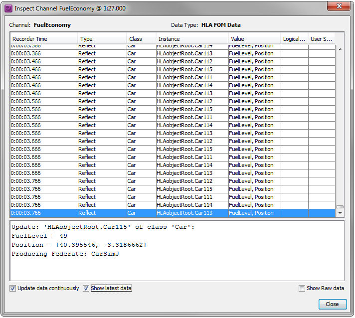
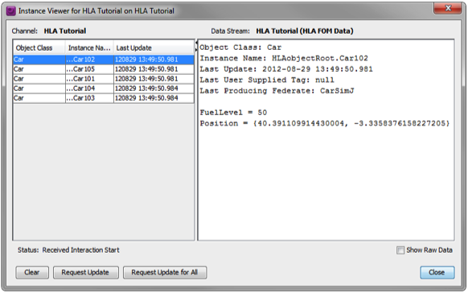

# Testing and Debugging Federates and Federations

So far we have been talking about how to develop federates for a federation. But how can you be sure that you got everything right before going to an integration event? When developing one single program you are in control of all pieces of the software at the same time and can test and debug the entire code base. With several, loosely coupled and potentially distributed HLA federates it gets much more difficult. We will look at several approaches:

- Look at the RTI
- Inspect the data
- Inspect the RTI calls
- Test with proven federates
- Test with proven data
- Get your federate certified
- Test and understand the federate performance
 
Note that we focus on testing the interoperability aspects of a federate. Verifying the overall simulation capabilities of a federation is another story which is much more domain specific.

### What should you test?

What you need to test varies from case to case. Assuming that the models in your federate have already been tested we need to look at least at the following things in the HLA module:

1. Are the publications correct?
2. Are the published objects and interactions indeed registered, updates and sent? At the right time?
3. Are the attributes updated at the right time with the correct values?
4. Is the encoding of the sent data correct?
5. Are the subscriptions correct?
6. Does the federate react to registered objects, updated attributes and received interactions as expected?
7. Does the federate gracefully discard received data that is obviously incorrect, for example attribute updates with incorrect data length?

Many federations usually require more than this. The federation agreement is usually a good place to start reading to understand these requirements.

### Look at the RTI
This debugging technique has already been shown throughout this tutorial. The RTI user interface provides a lot of useful insight on what the HLA interface of your application has achieved so far. We have shown the following:

- You can check that your federate creates a federation execution and joins the federation as expected. You may also want to check that it joins with the expected IP addresses and other networking parameters.
- You can check that it resigns and potentially destroys the federation execution. You can inspect the declarations (publish/subscribe) of the federate.
- You can check that object instances get created and deleted as planned.

There is often considerably more information in the GUI of an RTI so you may want to take some time to go through it as well as reading the Users Guide of the RTI.

Note that the user interface and debugging features varies from RTI to RTI. 

### Inspecting Data with a Data Logger

You can use a data logger to record and inspect the data that you federate publishes. This enables you to scrutinize attribute updates and interactions. The data may be shown in hexadecimal or decoded form. Data loggers may be tailored for a particular FOM or may be able to use any FOM, for example an extended standard FOM.

The diagram above shows a data logger that captures HLA FOM data, in this case Reflect Attribute Values, decodes the data and shows it on screen.

Another useful way to present the logged data is using an instance view.

### Tracing RTI Calls

To perform a detailed inspection on how you federate interacts with the RTI you may trace the RTI calls. This can be done in some debuggers. Some RTIs also provide the ability to print traces. Here is an example of a printout of the RTI calls for the Fuel Economy federation.

In many cases you may want to focus on one aspect of the services, for example how object instances are registered. This is also important for full-scale simulations where you may have thousands and thousands of attribute updates and interactions. Here is an example of how to focus on certain services:

[!Selecting HLA services to trace](img/trace_hla_services.png)

### Test with proven federates

One obvious way to test your federate is to see what happens when you connect it to other, proven federates. This is indeed a good test that can reveal a number of issues that you didn’t think of when developing you federate. It may also be used to discover requirements that do exist but haven’t been well documented.

This approach does have a few drawbacks:

- It is difficult to know exactly how much of the services and the FOM data exchange that you actually test. You may know very little about if and how a receiving federate processes data from your federate.
- It is difficult to discover if data was correctly exchanged if you don’t know the functionality of both federates very well.
- Both federates may be using the same, incorrect interpretation of the FOM, in particular if they were developed in the same project or by the same organization.

### Test with proven data
In larger projects you can usually get access to proven and correct data, usually collected using a data logger. This data can be used to stimulate your federate. Logged data is highly useful for automated testing.

If you develop a number of new federates you may use data loggers to exchange data between teams to verify compatibility.

### Get your federate certified
Several government organizations provide certification of HLA federates, in particular for defense oriented federates. This is a good way to get your federates tested and to get an official proof of HLA compliance.

In order to get your federate certified you need to provide a specification of what HLA services that is uses and what the federate publishes and subscribes to. The federate certification will then verify that the federate behaves as specified. The certification only tests the interoperability aspects. It does not test the accuracy of your simulation models, for example if the aerodynamics model in a flight simulator is correct.

### Test and understand the federate performance

Every federate has a performance impact on the federation. Every federate also has some performance limitations that may impact the entire federation. The limiting factor in most federations is how many updates and interactions that are exchanged. Two important questions are:

1. How many updates/interactions are sent per second from your federate in a
typical scenario?
2. How many incoming updates/interactions per second can your federate handle?

In most cases the ability to process incoming updates will be the limit for the entire federation. Consider a federation where ten federates send 1000 updates each per second and where all federates subscribes to everything. The biggest problem is obviously not to send 1000 updates per second but to process 9000 incoming updates per second.