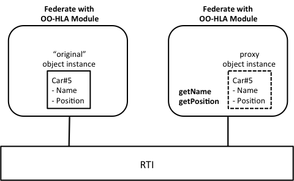
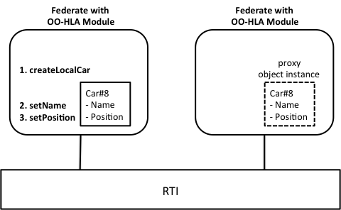
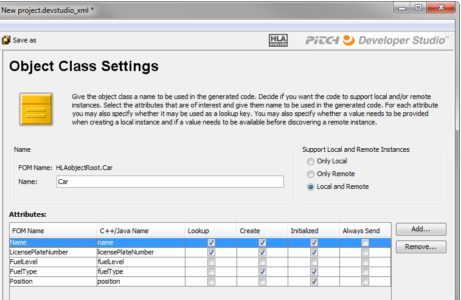

# Object Oriented HLA

### What is Object Oriented HLA?

Object Oriented HLA is not a standard. It is a design pattern for the HLA Module of an application. It builds upon the concept of FOM-specific proxy objects. The HLA Module typically works in two ways:



If another federate registers an HLA object instances, for example of the class Car, then the HLA Module presents a C++ or Java object that corresponds to that instance. The attributes of that object are populated as updates are received. To get these values you use a type-safe “get” operation, for example Car.getName. This can technically be seen as a remote or proxy object.



Your federate can create your own “local” object instances. The HLA module will then register the object in the federation. The attributes of that object can be updated with type-safe “set value” operations. These attribute values will automatically be sent to other federates.

Some of the advantages of object oriented HLA are:
- Fast and easy to add an HLA module to your simulator
- You don’t need to learn all the details of HLA
- Reduced risk of incorrect data encoding and decoding and other HLA programming mistakes.

Some of the disadvantages are:
- The middleware is usually locked to one particular FOM. It is not suitable for general-purpose tools that need to handle different FOMs, for example flexible data loggers.
- Need to acquire or develop the Object Oriented HLA module.
- Need to be careful with the configuration so that it does not subscribe to more object classes than necessary, which may impact performance.

### Types of OO-HLA implementations

There are several types of object oriented HLA modules. The most obvious approach is to program your own HLA module. This assumes that you know HLA reasonably well. This module can then be shared with your co-workers who need to understand less about HLA.

You may also buy a commercial HLA module that implements some particular FOM of interest, for example the RPR FOM. These may even implement other interoperability standards, like DIS in parallel with HLA.

A third approach is to use a code generator that takes a FOM as input and generates an object oriented HLA module for this FOM. The resulting code is then integrated into your federate project. You can develop your own code generator or get a code generator product.

### Using OO-HLA in the Fuel Economy Federation

We will now look at a sample object oriented HLA code generator named Pitch Developer Studio. First we will see how to generate the code and then we will look at how to integrate the code into our project. We start by loading the FOM into the tool and select the Car object class. We select that we want to support both local and remote object instances. We then check all attributes of the Car class.



This product introduces a few additional features for attributes, for example: 

**Lookup**: The generated code will contain lookup functions so that we can easily find an instance. By checking this box we indicate that this is an attribute that we want to use as a lookup key. In this case we select Name and LicensePlateNumber as lookup keys.

**Create**: The value of this attribute shall be supplied when a new instance is created. This is something we want to use for Name, LicensePlateNumber and FuelType. 

**Initialized**: It may not be useful for your program to discover remote object instances that have attributes that has not yet received any updates, i.e. have no values. By checking this box we make sure that the HLA module will not present the instance to your program until it is sufficiently initialized. For the car class we check all of the attributes except for the fuel level.

After setting some more parameters, like package name and source code directory, we can now generate code in C++ or Java.

### Sample OO-HLA program code

The generated code has some important classes:

**HlaWorld** is a class that handles the connection to the federation and provides methods like Connect and Disconnect. Note that these in turn will call HLA services like Connect, Create Federation Execution and Join etc. This is taken care of automatically so we don’t need to worry about this.

**CarManager** is a class that handles all local and remote car instances as well as providing additional functionality for the HLA Car class.

Here is some sample code that connects to the federation, registers a new car instance and finally disconnects from the federation. Note that this requires a developer to write only a fraction of the number of lines of code shown in previous chapters.

```cpp
HlaWorld _hlaWorld = HlaWorld.Factory.create();
_hlaWorld.connect();

HlaCarManager _carmanager=_hlaWorld.getHlaCarManager().
HlaCar _car = _carManager.createLocalCar("Sample Car", “ABC123”, FuelTypeEnum.DIESEL);

// Simulate

_hlaWorld.disconnect()
```

Here is some sample code that updates the fuel level and position of the car. Note that it uses an object called an Updater that enables us to update several attributes in one atomic transaction. Also note that these calls provides type safety. You cannot accidentally send a string value for the fuel level without getting a compile time error.

```cpp
HlaCarUpdater myUpdater = car.getHlaCarUpdater();
myUpdater.setFuelLevel(13);
myUpdater.setPosition(PositionRec.create(23.451, 45.662));
myUpdater.sendUpdate();
```

Finally, here is some code that loops through all cars in the federation and prints out their name and fuel level.