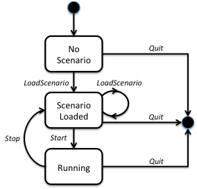

# Description of Federates and File Formats

## Overview

The federation consists of four federates:
1. Master from which the operator can control the entire federation
2. CarSimC which simulates cars and is written in C++
3. CarSimJ which simulates cars and is written in Java
4. MapViewer which displays the cars on a map

There is a shared scenario file that describes the scenario to be run. There are also car description files for each CarSim that describe car instances and
performance parameters.

The simulation models are very simple. The federation management is also very simplified but demonstrates some basic principles.

## About the Shared Scenario

A shared scenario is specified in a text file in the Scenario directory. There may be several scenarios in the directory. In our sample we provide the SanJose scenario and the Cupertino scenario. A scenario specifies:

- The map to use (in this case just a bitmap)
- The destination and the map to use
- The starting position for driving

All cars will drive in a straight line from the start to the destination. This what a scenario file looks like:

```
// Sample scenario file
Map=spain.jpg
TopLeftLat=44.577193
TopLeftLong=-10.522665
BottomRightLat=34.969554
BottomRightLong=5.207599
StartLat=40.401925
StartLong=-3.293953
StopLat=38.709285
StopLong=-9.136848
// End
```

## The Master Federate
The Master federate is a command-line application implemented in Java.

The Master publishes the LoadScenario, Start and Stop interactions. It subscribes to the ScenarioLoaded and ScenarioLoadFailure interactions.

When started it joins the federation and then presents the following message: 

```
Welcome to the Master Federate of the Fuel Economy Federation
Make sure that your desired federates have joined the federation!
```

It the presents the following menu

```
Select a command
1. Load the Redmond scenario
2. Load the Cupertino scenario
3. Start simulating
4. Stop simulating
Q. Quit the Master Federate
```

The user can give commands over and over again until he selects Quit. The Load commands will prompt the user for the amount of fuel to be used. It will then result in the Master sending a LoadScenario interaction. Command 3 and 4 will result in a Start and Stop interaction respectively.

When a ScenarioLoaded interaction is received it will print out:

```
Scenario Loaded interaction received from <federatename> 
```

When a ScenarioLoadFailure interaction is received it will print out:

```
Scenario Load Failure interaction received from <federatename>
Reason: <Error message> The configuration for this federate is stored in the file <something>
```

This includes RTI configuration (CRC host and port), federation name, federate name, federate type and more. Some RTIs may require additional configuration using their own configuration files.

## The CarSimC Federate and its States

The CarSimC federate is a command line federate implemented in C++ that simulates cars.

The CarSim subscribes to the LoadScenario, Start and Stop interactions. It publishes the Car class with the Name, LicensePlate, FuelLevel, FuelType and Position attributes. It also publishes the ScenarioLoaded and ScenarioLoadFailure interaction.

When started it reads the car description files in its Cars directory. It then joins the federation, registers the car instances and the presents the following message:
```
CarSimC has joined. Ready to receive scenario.
Press Q at any time to quit.
```
When it receives a LoadScenario interaction it will load the scenario, position the cars at the starting position, fill them with the specified amount of fuel, reset the time to zero, send a ScenarioLoaded interaction and then present the following message:

```
CarSimC has loaded scenario <Scenario name>
The following cars are standing by at the starting point:
    <Name of car 1>
    …
    <Name of car n>
```

If the scenario file could not be found or if it is incorrect a LoadScenarioFailure interaction will be sent and an error message is printed.

When it receives the Start interaction it will start running the cars along a straight line from the current position (initially the starting position) of each car towards the destination. Cars will stop when they reach the destination. It will also present the following message:

```
CarSimC is now simulating <n> cars
```

When it receives the Stop interaction it will stop running the cars and show the message.

```
CarSimC has stopped simulating.
```

It is now possible for the master to send a Start message to continue using the current location or to set a new scenario. The following state diagram shows the allowed transitions between the three states NoScenario, ScenarioLoaded and Running.



As can be understood from this diagram certain interactions from the Master must be rejected in certain states, for example with the messages:
```
Cannot start when no scenario has been loaded.
Cannot load a new scenario while running
Cannot stop when not running
```
Let’s look at the car description that each federate has in its Cars directory. Each car description file contains the following:
```
// 440d car file
Name=A-Brand 440d
LicensePlate=ABC-123
FuelType=Diesel
NormalSpeed=90
LitresPer100km1=25
LitresPer100km2=15
LitresPer100km3=8
// End
```
The cars will always drive at their “normal” speed, in this case 90 km per hour in this simplified model. The fuel consumption is different during the first minute, the second minute and the third minute and beyond. The high initial fuel consumption is due to the cold start of the engine. A car may run out of fuel which will make it stop.

The configuration for this federate is stored in the file \<something\>. This includes RTI configuration (CRC host and port), federation name, federate name, federate type, frame rate and more. Some RTIs may require additional configuration using their own configuration files.

## The CarSimJ Federate
The CarSimC federate is a command line federate implemented in Java that does exactly the same as the CarSimC federate.

## The MapViewer Federate
The MapViewer federate is a graphical application implemented in Java that presents a list of the cars to the left and to the right a map with the cars displayed as icons.

The MapViewer subscribes to the LoadScenario, Start and Stop interactions. It also subscribes to the Car class and the Name, LicensePlate, FuelLevel, FuelType and Position attributes.

When receiving s LoadScenario interaction the MapViewer will load the corresponding scenario file, display the specified map and set the simulation time to zero. When a car instance is discovered it will be presented in the list to the left, together with its attribute values. The scenario time is also presented in the display.

## Publish Subscribe Matrix

#### Interactions:

|      |Master|CarSim|MapViewer|
|------|------|------|---------|
|LoadScenario|Pub|Sub|Sub|
|ScenarioLoaded|Sub|Pub|Pub|
|ScenarioLoadFailure|Sub|Pub|Pub|
|Start|Sub|Pub|Pub|
|Stop|Pub|Sub|Sub|

#### Attributes:

|      |Master|CarSim|MapViewer|
|------|------|------|---------|
|Car.Name|-|Pub|Sub|
|Car.LicensePlateNumber|-|Pub|Sub|
|Car.FuelLevel|-|Pub|Sub|
|Car.FuelType|-|Pub|Sub|
|Car.Position|-|Pub|Sub|