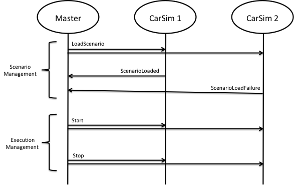

# Federation Agreement

## General

### Purpose, audience

The Fuel Economy Federation is an analysis federation that is intended to study and compare the fuel consumption of vehicles under different conditions. This federation agreement is the design specification (or contract) for the federation. It provides requirements for the interoperability aspects of any participating federate. 

This Federation Agreement is a sample federation agreement developed for learning purposes. The intended audience is anyone who wants to understand and potentially develop federates that need to participate in the Fuel Economy federation. It can also be used as a basic template for small federation agreements. Note that the SISO FEAT group provides a more advanced template for federation agreements. 

### Revision history 

|Version|Date|Author|Descriptions|
|-------|----|------|------------|
|1.0|2012-07-01| BM | First complete version|

### Abbreviations, definitions

|Abvreviation|Definition|
|------------|----------|
|FOM|Federation Object Model|
|HLA|High-Level Architecture as defined in IEEE 1516-2010|
|IEEE|The Institute of Electrical and Electronics Engineers, Inc|
|FEAT|Federation Agreement Template, a working group within SISO|
|TBD|To Be Done|

### References 

1. IEEE Standard for Modeling and Simulation (M&S) High Level Architecture (HLA), IEEE 1516-2010, www.ieee.org 
2. Fuel Economy Federation FOM 
3. Description of Federates and File Formats

### Related documents 
- None

## Overview

### Conceptual domain model

The following entities and processes are simulated in this federation:

- Cars and their fuel consumption when driving along a specified track. Both diesel and petrol cars are included.

### Federation and participating federates

The federation can have three types of federates:

1. The Master federate is responsible for the management of the execution, for example assigning scenarios, starting and stopping. There shall be exactly one Master federate in each federation.

2. Car Simulator federates are responsible for modeling car objects, their movements and fuel consumptions. There may be any number of car simulator federates. Each federate may model one or more car objects.

3. Analysis, visualization and data collection federates. These are used for analysis of the simulation results during and after the execution. They may only consume data. They may not affect the simulation. There may be any number of these federates.

In the first version of the federation the name of the federation execution shall be “Fuel Economy”. The following federate names shall be used.

|Federate Name|Description|
|-------------|-----------|
|Master|Master federate that manages the federation|
|CarSimC|Simulates A-Brand cars. Written in C++|
|CarSimJ|Simulates B-Brand cars. Written in Java|
|MapViewer|Displays cars on a map|

### FOM

The Fuel Economy Federation FOM (FEF FOM) is provided in the next section

### Overview of information flow, DDM usage (optionally)
 
Information about car objects will be produced by the car simulators and consumed by analysis, visualization and data collection federates.

Management interactions will be produced by the Master federate and responded to by the car simulators. 

### Relation to other systems

No relations.

## General Agreements

### Standards, hardware, software and networks
Federates shall run on one or more computers with Windows 7, RedHat Enterprise Linux 6 or Mac OS X 10.6 using their native TCP/IP networking. A network with at least 100 Mbps bandwidth using a 100 Mbps (or better) switch shall be used. The end user decides the network addresses for participating computers. 

The native HLA 1516-2010 services and APIs shall be used by all federates. An RTI for HLA 1516-2010 from Pitch, version 4.4 shall be used. 

### Principles for sending interactions

All interactions shall be sent with the reliable transportation type.

### Principles for updating attributes and ownership

Updates for static attributes shall be sent reliably on the creation of the object and upon request.

Updates for attributes that change over time shall be sent reliably whenever a new value is available (i.e. on change).

Federates shall implement the Provide Attribute Values callback for all attributes in order to support later joining federates to get the most recent value.

The federation shall have the AutoProvide switch enabled in the FOM. Federates shall thus not be required to call the Request service when it discovers a new object instance from another federate.

Ownership services are not used in this federation.

### Technical representation of data

A full specification of the data representation is available in the FEF FOM in the next section . All data types are based on the standard Basic Data Types in the HLA 1516-2010 standard.

Strings shall be exchanged using the HLAunicode representation.

Integers and floats shall use Big Endian encoding.

Enumerated values shall use HLAinteger32BE representation.

### Time management and time

This federation does not use HLA Time Management services.

The scenario time shall be set to zero when a scenario has been successfully loaded. The start interaction shall start the scenario time running. The federation then runs in “real” time multiplied with a time scale factor. If this factor is 1.0 then one second in the scenario time corresponds to one second of real time, i.e. real time. If, for example, the value is 15 then the scenario time shall run 15 times faster than real time.

The stop federation shall stop the scenario time. After a stop interaction has been received the start interaction shall start the time at the current scenario time value. 

No time stamps are exchanged during the execution. Each federate may use the internal time representation that meets their needs.

## Exchange of information

### Information about Car objects
Updates shall be sent for all attributes of Car objects whenever the value changes.

### Management interactions
These are specified in the section Managing the federation.

## Managing the federation

### Start-up and shutdown
Federates are started and shut down manually. The end user of the federation is responsible for verifying that all required federates are available before starting up a scenario. No federates are allowed to start after the scenario management has taken place.

### Overview of scenario and execution management

The scenario and execution management follows the following pattern:

The scenario management is required to take place before the execution management. The Master federate sends a LoadScenario interaction. Each federate responds, indicating whether the scenario was successfully loaded or not. The operator of the Master federate is responsible for manually assessing whether the execution should be started, based on the responses.

The execution management is performed as follows: The Master initially sends a start interaction. Finally it sends a stop interaction. The end user is responsible for verifying that participating federates have correctly reacted to these interactions.

### Scenario management

The Master federate is responsible for coordinating the scenario. The scenario is stored in a separate file as described in the appendix “Description of Federates and File Formats”. Three interactions are used for coordination of the common scenario:

#### Interaction: LoadScenario (ScenarioName, InitialFuelAmount)

This interaction shall be published by the Master federate and subscribed by all Car Simulators and Map Viewer. The name of the scenario and the initial fuel amount shall be supplied. Each federate shall load the specified scenario when it receives this interaction. Car simulators shall also assign the specified amount of fuel to each car that it simulates. The scenario time of all federates shall be set to zero. Note that this interaction is not allowed when the simulation is running.

#### Interaction: ScenarioLoaded(FederateName)

This interaction shall be published by each Car Simulator and subscribed by the Master federate. Each Car simulator shall send this interaction when it has successfully loaded a scenario. Other federates, like the Map Viewer, may optionally send this interaction. The name of the federate shall be supplied. The Master shall present the information received to the user.

#### Interaction: ScenarioLoadFailure(FederateName, ErrorMessage)

This interaction shall be published by each Car Simulator and subscribed by the Master federate. Each Car simulator shall send this interaction it fails to load a scenario. Other federates, like the Map Viewer, may optionally send this interaction. The name of the federate and an error message shall be supplied. The Master shall present the information received to the user who is responsible for taking appropriate action.

### Execution management (starting and stopping)

The Master federate is responsible for coordinating the start and stop of the simulation. Two interactions are used:

#### Interaction: Start(TimeScaleFactor)

This interaction shall be published by the Master and subscribed by each Car Simulator and Map Viewer. Each Car Simulator shall start simulating when this interaction is received. If the Car Simulator has stopped simulating due to a Stop interaction the Start interaction shall cause the federate to continue simulating at the current time. The TimeScaleFactor indicates the ratio between the elapsed scenario time and the real time. See the section about time (above).

#### Interaction: Stop

This interaction shall be published by the Master and subscribed by each Car Simulator and Map Viewer. Each Car Simulator shall stop simulating when this interaction is received. The stop shall be performed in such a way that the simulation can be restarted if a Start interaction is received later on.

Note that the above interactions are used to start and stop the scenario time, i.e. the entire simulated world. The purpose is not to start and stop cars.

### Save/restore

Not used in this simulation.

### Error handling

Errors shall be handled as follows:

1. **Federate Internal Errors**: If an internal error occurs within a federate that prevents it from continuing to perform its responsibilities it shall signal the error on the console and then resign from the federation.

2. **Incorrectly encoded data in updates and interactions**: If incorrectly encoded data is received by a federate then this data shall be reported to the user and discarded. It is required for all federates to be able to detect at least incorrect data size for incoming data.

3. **Incorrect sequence of management interactions**: If a management interaction occurs that is out of sequence then this shall be reported to the user and discarded. An example of this is sending a Start interaction when no LoadScenario interaction has been sent.

4. **Incorrect set of federates**: It is up to the user to detect and handle any errors in the set of federates, for example missing Master federate or zero Car Simulators.

## Handling output

### Logging

Data shall be collected using a COTS data logger for HLA. This is optional.

### Analysis
Analysis shall be performed by importing and processing logged data into MS Excel.

## Federation specific section
- Not used -

## Appendices
Fuel Economy Federation FOM.
File Formats.