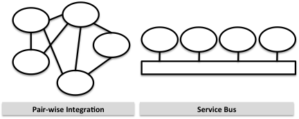

# Topologies for Integrating Systems

The previous chapter introduced the concept of a Federation of systems. So how do we connect systems so that they can exchange services in order to meet a common goal?

The diagram below shows two common topologies:

### Pair-wise

When using pair-wise integration you connect systems that need to exchange services in pairs. For each pair of systems, you establish an agreement of what services to exchange. This works well for a few systems, but as the number of systems grows the number of connections will grow exponentially. Another issue is that each system needs explicit knowledge about all other systems that it needs to exchange data with. When you add one new system, you may need to modify a large number of existing systems.

### Service Bus

The other type of integration is called Service Bus. Each system has just one connection to the service bus. A common set of services has been agreed upon. Each system provides or consumes the particular services that it is interested in. Each system can be replaced by another system without updating several other systems. New systems that produce or consume services can easily be introduced. This is more flexible and scalable.