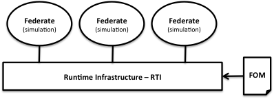

# HLA Terminology

The recommended way to draw a graph for systems that interoperate using HLA is through a “lollipop” diagram, as shown below:

The basic topology is a number of systems that have one single connection to a service bus that is called the Runtime Infrastructure (RTI). The RTI provides information, synchronization, and coordination services. This type of topology does not force each system to know which other systems that consume or produce information. This approach enables the group of systems to be gradually extended over time and facilitates the reuse of systems in new combinations.

There are five important concepts:

### Runtime Infrastructure

The Runtime Infrastructure (RTI), which is a piece of software, that provides the HLA services. One of them is to send the right data to the right receiver.

### Federate

The Federate, which is a system that connects to the RTI, typically a simulator. Each federate can model any number of objects in a simulation. It can, for example, model one aircraft or hundreds of aircrafts. Other examples of federates are general tools like data loggers or 3D visualizers.

### Federation

The Federation, which is all of the federates together with the RTI that they connect to and the FOM that they use. This is the group of systems that interoperate.

### Federation Object Model (FOM)

The Federation Object Model (FOM) which is a file that contains a description of the data exchange in the federation, for example the objects and interactions that will be exchanged. This can be seen as the language of the federation.

### Federation Execution

The Federation Execution, which is a session when the federation runs, for example a pilot training session when you run several flight simulators. If you run the federation several times you will have several federation executions. 

All of these concepts will be used extensively throughout this tutorial and also explained in further detail.