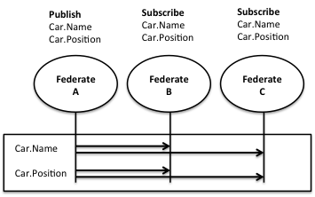

# Information Services

These services enable federates to exchange data according to the FOM using a Publish/Subscribe scheme.

The RTI keeps track of which federates that subscribe to each type of object, attribute, or interaction, which means that the federates want to receive that type of data. It also keeps track of which federates that publish each type of object, attribute, or interaction, which means that they are able to send that type of data. Finally the RTI acts like a switchboard and delivers data from publishers to subscribers as shown in the diagram above.

To illustrate this you can look at this “Publish/Subscribe Matrix” with a car simulator, a data logger and a map viewer. Federates are listed in the top row and attributes of the car object are listed in the left column.

| Attribute | CarSim | Data Logger | Map Viewer |
| --------- | ------ | ----------- | ---------- |
| **Car.Name** | Publish | Subscribe | Subscribe |
| **Car.Position** | Publish | Subscribe | Subscribe |

The simulator CarSim publishes the name and position of cars. The data logger and the map viewer subscribe to the name and position of cars. The RTI will make sure that any name and position of a car will get delivered to the data logger and map viewer. It is not necessary for the CarSim to keep track of which federate that wants to get car information at any given time. The RTI handle this automatically.

It is possible to exchange hundreds of thousands of updates per second between standard PCs using a modern RTI. Typical latency is in the range of a millisecond.

There is also a more advanced type of filtering based on the data values rather than the class of the data, called Data Distribution Management. This can be used for example when a federate only wants to get updates for cars in a particular geographical area. This enables federations to run large scenarios while limiting the load on each simulator.

