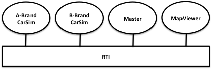
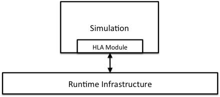

# Getting Connected

This chapter shows how to connect to the federation and how to leave it. It gives an overview of the services without getting into detail about all exceptions or data types. For a complete description, see the HLA standard. You may also want to look at the C++ and Java APIs and code samples at the end of this chapter.

### An Overview of an Example Application

This chapter shows how to connect to the federation and how to leave it. It gives an overview of the services without getting into detail about all exceptions or data types. For a complete description, see the HLA standard. You may also want to look at the C++ and Java APIs and code samples at the end of this chapter.

In this case A-Brand will simulate their 319 and 440d models whereas B-Brand will simulate their 4-8 and MountainCruiser models. There will be more car simulators later so the design will not be locked to these specific cars. There will be one management federate called Master from which an operator can set up the scenario and start and stop the simulation. There will also be a federate called MapViewer that displays a map with the cars and their fuel status.

The following information is available about our example federation:

- The Federation Agreement
- The Federation Object Model (FOM)
- A description of the Federates and the File Formats.

You are encouraged to refer to them while reading this tutorial.

### An HLA Module for Your Simulation

You usually add HLA functionality to a new or existing simulation in a separate module. We have chosen to call it the HLA module.

It may be tempting to develop one single HLA module that fits all of your simulations. Such an HLA module would subscribe to all kinds of data in the FOM. This works for smaller federation but will unfortunately limit the scalability of your federation. Best practice is to develop an HLA module that focuses on only the data that one particular federate (or class of federate) needs to publish and subscribe.

This tutorial describes how to develop the HLA module. The HLA module performs calls according to the HLA standard to the Runtime Infrastructure (RTI). You will also need to write code that connects the internals of your simulation with the HLA module. Note that for some simulations you may choose to make the HLA module optional, which means that your simulation can run both with and without an HLA connection.

### Practical Exercise

See the lab section for a practical guide to implement your own federation.

