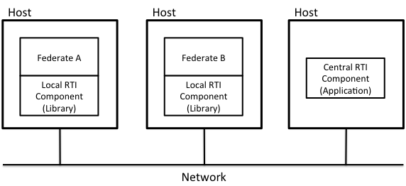

# The Central and Local RTI components

An RTI consists of two types of software components, as shown in the following picture:

The **Local RTI Component (LRC)**, is a local library installed on each computer with a federate. For C++ federates this is a “dll” or ”so” file. For Java federates this is a “jar” file.

The **Central RTI Component (CRC)**, is an application that coordinates the federation execution and keeps track of the joined federates. The CRC is a program that needs to be started at a computer with a well-known address. You need to start the CRC before any federate can join a federation. The CRC user interface is a good point to get an overview of the federation.

You may have several federates as well as the CRC on the same computer if you wish. Note that you must install the LRC libraries on each computer with a federate.