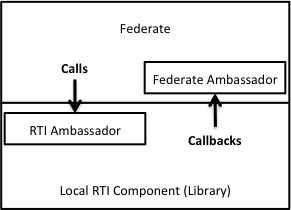

# Calls and Callbacks

There will be both calls to the RTI and callbacks from the RTI to your federate. You will use an object called the RTI ambassador for making calls to the RTI. It is created using an RTIambassadorFactory in section 4.6. You need to supply a Federate Ambassador, as shown in the Connect call above, that the RTI will make callbacks to.

There are two callback models: Immediate, which means that the RTI will deliver the callbacks in a separate thread as soon as they are received. The other model is called Evoked which means that you explicitly call the Evoke method to get callbacks delivered. We suggest using the Immediate mode. Less advanced developers may choose to use the Evoked model since it uses only one thread for calls and callbacks.

### HLA Service: Connect

This service connects your simulation to an RTI. The parameters for this connection, like network address, are provided either through a parameter (a string) called the Local Settings Designator, a configuration file, environment variables, or a combination of these. For best flexibility, avoid hard coding this parameter into your program. You also need to specify whether callbacks from the RTI should be performed immediately or if they should be explicitly evoked. Be careful to handle the Connection Failed exception, which typically occurs when there is no RTI available given the specified network address. If the Connect service throws an exception there is no use trying any other HLA service before you have successfully connected.

Read more about Connect in section 4.2 of the HLA Interface Specification.

### HLA Service: Create Federation Execution

This service creates a federation execution with a specific name. You may try to create a federation execution every time since there are no major problems with trying to create a federation execution that already exists. The only result will be an exception saying that it already exists, which in many cases can be safely ignored. So be sure to catch the “The specified Federation Execution already exists” exception and handle it silently. You need to provide a valid FOM as well, actually a list of one or more FOM modules. Be sure to watch for exceptions for not being able to locate the FOM module as well as for invalid FOM modules. There are also some additional parameters, for example time representations that will be described in a later chapter.

Read more about Create Federation Execution in section 4.5 of the HLA Interface Specification.

### HLA Service: Join Federation Execution
This service makes your simulation a member of a federation execution. You need to provide the name of the Federation Execution that you want to join. You should also provide the name and type of your federate. Be sure to handle the exceptions when the federate name is already in use by another federate. There are additional parameters that will be described later. 

Read more about Join Federate Execution in section 4.9 of the HLA Interface Specification.

### HLA Service: Resign Federation Execution 

This service resigns the federate from the federation, i.e. your simulation will no longer be a member of the federation execution. It requires a directive that specifies what should happen with, for example, objects that the federate has created but not deleted. Unless you have special requirements it is recommended that you use the CANCEL_THEN_DELETE_THEN_DIVEST directive.

Read more about Resign Federation Execution in section 4.10 of the HLA Interface Specification.

### HLA Service: Destroy Federation Execution 
This service destroys the federation execution. You may try to destroy the federation execution every time you have resigned. If there are still other federates in the federation this operation will fail and the “Federates are joined” exception will be thrown, which in many cases can be safely ignored.

 Read more about Destroy Federation Execution in section 4.6 of the HLA Interface Specification.

### HLA Service: Disconnect
This service disconnects your federate from the RTI. It is the last service you call to the RTI. After this call you cannot make any RTI calls until you have performed a connect call.

Read more about Disconnect in section 4.3 of the HLA Interface Specification.

### Additional Comments

Once your federate is connected it can also call the List Federation Executions service, which returns a list of all available federations for this RTI.

Your federate may also become disconnected during the execution due to external issues like communication failures, broken cables, etc. In this case all RTI calls will throw the Not Connected exception. In this case you need to Connect again. This is described in the Fault Tolerance section of this tutorial.