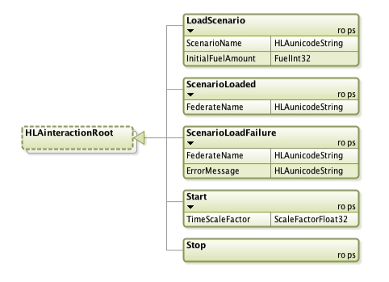
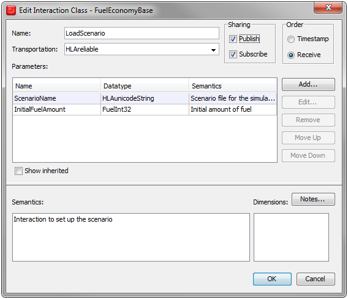

# Interactions

We will start by defining five Interaction Classes. They are all subclasses of the predefined class HLAinteractionRoot.

The LoadScenario is used to inform all participating federates about the scenario to run. It provides the name of the destination as well as the amount of fuel to be filled before starting. The ScenarioLoaded interaction is used by the federates to confirm that the scenario has been loaded. There is also an interaction called ScenarioLoadFailure to indicate that the scenario could not be loaded. There are also start and stop interaction to control the execution. 

Let’s take a closer look at the LoadScenario interaction.

This interaction will be both Published and Subscribed to by federates in the
federation. There are two parameters:
- **ScenarioName**, which uses the predefined data type HLAunicodeString.
- **InitialFuelAmount**, which uses a user-defined data type called FuelInt32.

There are also additional properties of an interaction that will be introduced later in this tutorial.

Read more about Interactions and Parameters in section 4.3 and 4.5 of the Object Model Template Specification.