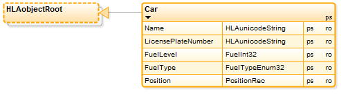
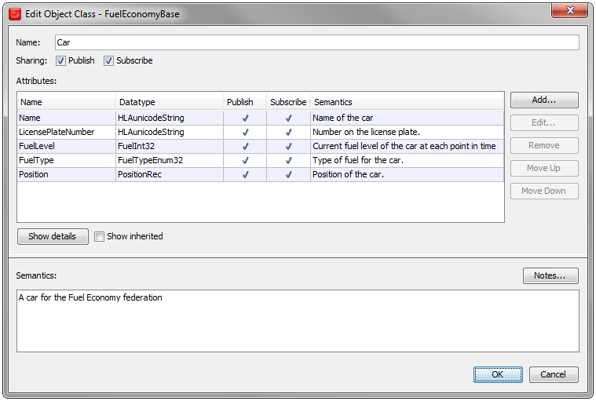
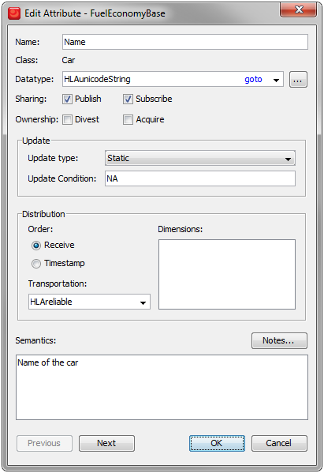

# Objects

We will now define the Car Object Class. It contains a number of attributes for the car that will be updated over time. This is what it looks like:

The Car object class is a subclass of the predefined HLAobjectRoot. Let’s take a closer look at it:

This class will be both Published and Subscribed by federates in the federation.
There are five attributes:
- **Name** and **LicensePlateNumber** which use the predefined data type HLAunicodeString.
- **FuelLevel** which use the FuelInt32 that is also used in one of the interactions.
- **FuelType** which describes type of fuel used by the car. This is an enumeration that we will soon look at in detail.
- **Position** which is a Record that we will also look at in detail.

There are also additional properties of a class that will be introduced later in this document.

Read more about Object Classes and Attributes in section 4.2 and 4.4 of the HLA Object Model Template Specification.

### Attributes

Let’s take a loser look at the Name attribute of an object class:

In this detailed view you can also see the update type, which for the Name is Static.

Other update types are Conditional and Periodic.
There are also additional properties of an attribute that will be introduced later in this tutorial.

Read more about Attributes in section 4.4 of the HLA Object Model Template Specification.