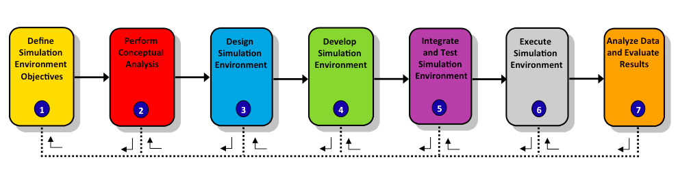

# Summary

### About the Fuel Economy Federation - interoperability and reuse

We have built a federation that demonstrates and explains the basic capabilities of HLA in detail. We have seen how the federates interoperate based upon a Federation Agreement. We have also seen how the data exchange follows the FOM that we developed. We have been able to register and discover object instances and update their attribute. We have sent and received interactions. There are also a number of more advanced aspects that you may also have observed:
- Since we can add more publishers and subscribers, without modifying existing federates, it is easy to gradually extend the federation.
- We can also reuse federates in new federations.  We can also easily replace federates and, for example, introduce another publisher of simulated cars.
- The targets of interactions are not hard coded in the sender federate. Because of this we can add more federates that react to an event. It is thus easy introduce data loggers and visualizers.

A high degree of interoperability and reuse has been achieved between simulations that follow the Fuel Economy Federation Agreement. Still we have imposed very few constraints on the internal architecture and implementation of each participating federate.

### DSEEP - a process for developing federations

In this tutorial we have looked at the technical development of a federate for a federation with a federation agreement and a FOM. But how does this happen in real life? How do you arrive at a design and make sure that you can deliver a working federation on time? There is a process for design, development and execution of distributed simulations called DSEEP. It consists of seven steps.

The steps are as follows:
1. Define Federation Objectives and constraints. In this step we specify the goals and any constraints, like time or budget
2. Perform Conceptual Analysis. In this step we develop a typical scenario for the simulation and produce a conceptual model.
3. Design Federation. In this step we select federates, allocate responsibilities to them and decide on any development of new federates
4. Develop Simulation Environment. In this step we develop the Federation Object Model (FOM), the Federation Agreement and adapt or develop federates
5. Integrate and Test Simulation Environment. In this step we perform testing, sort out bugs and validate that the federation works as intended.
6. Execute Simulation. In this step we finally execute the simulation.
7. Analyze Data and Evaluate Results. 

DSEEP is also an IEEE standard (1730-2010) which is freely available to SISO members. It can also be purchased on the IEEE web site.

### More HLA Features: Ownership, Time Management and DDM
In Part Two of the tutorial we will take a look at a number of additional HLA features. These are:

**Ownership**. What if we want one of the cars that is currently simulated by CarSimC to be simulated by CarSimJ instead? What if we want to introduce a separate federate that only performs fuel level calculation for the cars that are modeled by the CarSims? What if we want to have a failover simulator that takes over the responsibility for modeling cars if any of the regular car simulators fail? This can be achieved with HLA Ownership Management.

**Time**. Many readers have probably noticed that the handling of scenario time is less than satisfactory in the current federation design. Network delays may cause the federates to start at different points in time. Different hardware clocks may cause the scenario time to run at different speed on different computers. HLA has some very powerful services that enable you to exchange time stamped data and to coordinate the time advance of your simulations.

**Data Distribution Management**. Imagine that we have thousands of cars. How can we filter out just a limited number of these on different criteria like fuel type, position or something else? The answer is DDM services, which becomes more interesting as your federation and scenario grows.

**Management Object Model (MOM)**. It is possible to gain a deeper insight into which federates that have joined and their state by asking the RTI. This is very useful for example in the Master federate.

### Have Fun!
We would like to encourage you to play around with the samples. Implement some code of your own. Study the standard. Visit the SISO web site and read about other peoples experience with HLA. But most important: go back to your original simulations and start thinking about how HLA can help you build simulations that do things that you couldn’t do before. Solve problems! Be innovative!