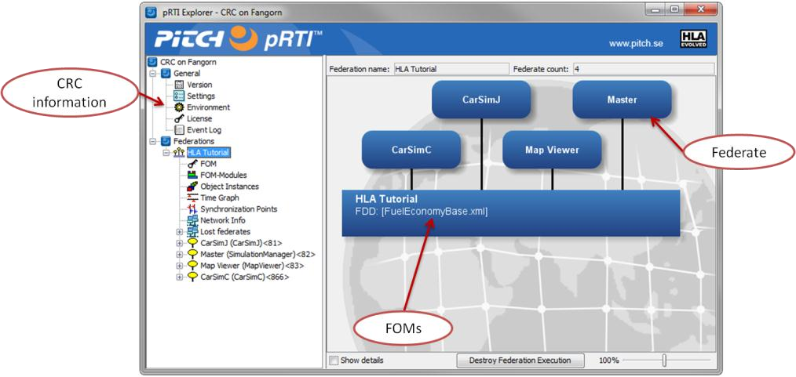

# Lab 2: Connect, Create and Join

In this lab we will study the Connect, Create and Join steps in the federation.

## About the Pitch pRTI User Interface
The following picture shows the most important part of the Pitch pRTI user interface:

## Study and verify the start-up

Follow these steps
1. Start the Pitch RTI Free (CRC)
2. Note that there is no federation and no federates visible in the RTI
3. Start the Master federate. Look in the RTI user interface. You should see the Federation Execution named “Fuel Economy” as well as the “Master” federate.
4. Start the other three federates (CarSimC, CarSimJ and MapViewer) and verify that they join the federation as expected.
5. Terminate the federates, one by one, except for the Master, and verify that they disappear from the federation accordingly.
6. Finally terminate the Master federate and verify that it disappears from the federation and that the federation execution goes away.
7. Shut down the RTI.

## A look at source code and APIs
To study the C++ and Java source code of the fuel economy federates, open the source code directory using the following Start menu item. Note that the source code of the different federates are stored in different subdirectories.

HLA Evolved -> Fuel Economy-> Source code

To study the C++ and Java APIs of HLA Evolved, use the following Start menu items:

Pitch pRTI Free -> Documentation -> HLA Evolved Doxygen

Pitch pRTI Free -> Documentation -> HLA Evolved JavaDoc

Do the following:
1. Open the CarSim Source code (C++ or Java of your choice). Look at the following classes:
- CarSimJ: se.pitch.hlatutorial.carsim.hlamodule.HLAinterfaceImpl 
- CarSimC: /source/HLAmodule.cpp

Locate the code that performs the Connect, Create Federation and Join Federation Execution calls. Note the exception handling which, for clarity, has not been included in the pseudo code in the main text of this tutorial.

2. Locate and study these three services in the HLA Evolved APIs (Doxygen and JavaDoc above).
3. If you have the IEEE 1516-2010.1 specification available, read more about these services in the standard.
4. Perform step 1-3 for the three services Resign Federation Execution, Destroy Federation Execution and Disconnect.