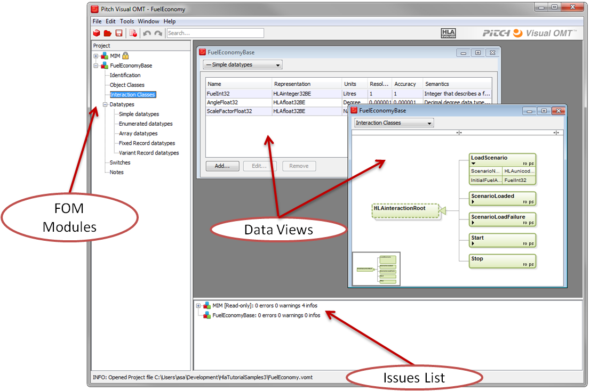

# Lab 3: Developing a FOM for Interactions

In this lab we will study the FOM and the interactions in particular.

## About the Pitch Visual OMT User Interface
The following picture shows the most important part of the Pitch Visual OMT user interface:

In the left pane you can open and close different FOM modules in the project. By double-clicking an item in the left pane, for example Identification Table, you will open this table.

## Locating the FOM
To open the FOM start Pitch Visual OMT Free and select the Fuel Economy FOM project in the start dialog.

## A look at interactions
Do the following:
1. Open the FOM and locate the Fuel Economy FOM module
2. Inspect the contents of the Identification table
3. Inspect the tree of interaction classes. Open and close their parameter list using the small triangle. Double-click on the LoadScenario interaction to inspect it.
4. Go to the data types and look at the simple data types. Here you should inspect the FuelInt32.
5. Now go to the MIM FOM module. This module contains a lot of things that are predefined in the HLA standard.
6. Inspect that various data types in the MIM. Note that all the predefined items are prefixed with HLA.
7. Now try and modify some parts of the FOM. Add your own interaction Refuel with a parameter MaxMoneyAmount. Add a data type EuroType32.
8. Note that you cannot save your modified FOM using the Free version of Pitch Visual OMT.
9. Shut down Pitch Visual OMT