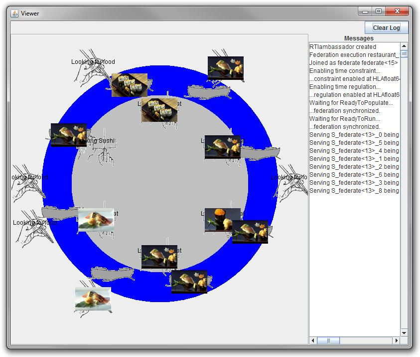

# The Sushi Restaurant Federation

When HLA was first introduced one of the more advanced samples was the Restaurant federation. It uses a large number of HLA services. This federation, originally developed for HLA 1.3, has been migrated to the most recent version of HLA. A full description of the federation is provided in the book “Creating Computer Simulation Systems - An Introduction to the High Level Architecture” by Fred Kuhl, Judith Dahmann and Richard Weatherly, ISBN: 9780130225115.

Note that this federation was originally developed using older versions of both Java and HLA. This means that some of the code may not use what we today consider best practice. Nevertheless, the rich set of HLA features used still makes it an interesting federation.

## Overview of the federation

The federation models a classic sushi restaurant where the chefs prepare sushi and places them on boats that transport them to the customers.

## How to run the federation
This federation is installed as part of the HLA Evolved starter kit. See the Lab Introduction for details.

On the Start Menu, locate the following items:
- Start -> HLA Evolved -> Sushi Restaurant -> Production
- Start -> HLA Evolved -> Sushi Restaurant -> Transportation
- Start -> HLA Evolved -> Sushi Restaurant -> Consumption
- Start -> HLA Evolved -> Sushi Restaurant -> Viewer
- Start -> HLA Evolved -> Sushi Restaurant -> Manager

To run the federation, start pRTI Free and then the above federates. Note that the Manager federate should be the last one that you start. 

The source code is available in a directory that is opened using: 

- Start -> HLA Evolved -> Restaurant -> Source Code

To inspect the FOM, start Pitch Visual OMT Free and select the Sushi Restaurant project.

## Production Federate
This federate manages a collection of Chef object that produces sushi objects. When a boat passes close to the chef the chef can give the sushi away and place it on a boat.

## Transportation Federate
The transportation manages a collection of boat object. When a boat is close to a chef that has produced a sushi the production federate can offer the transportation federate to take ownership of the sushi. The sushi will then be loaded on the boat and transported to potential costumers

## Consumption Federate
The Consumption federate models a number of consumers. When a boat containing a sushi passes close to a customer it can take over ownership of the sushi and eat it.

## Manager Federate
The manager federate keeps track of the federates in the federation and is responsible for settings synchronization points (ex ReadyToRun). It is also paces the time to keep the federation advancing at the desired speed.

## Viewer Federate
The viewer federate displays the chefs, boats, customers and sushi in a graphical view. The federation simulates the activities at a restaurant.